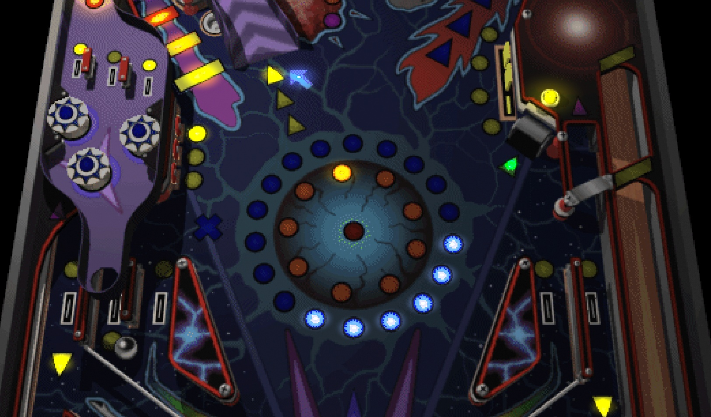
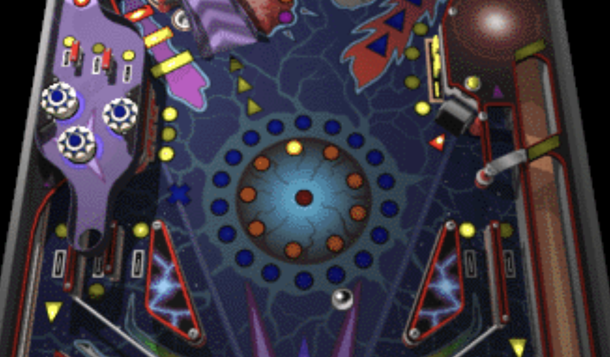
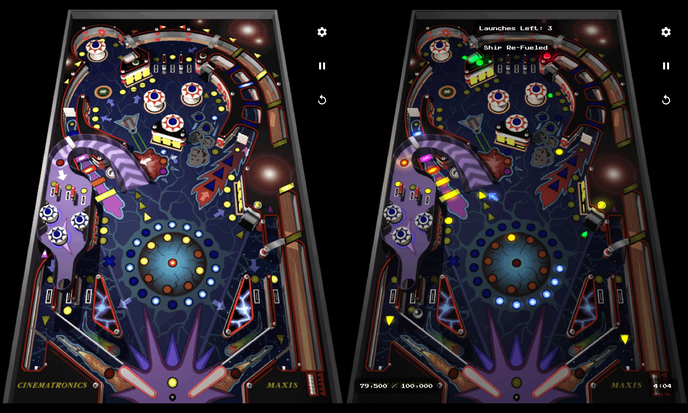

<!-- markdownlint-disable-file MD033 -->

# Space Cadet Pinball - JUICED Edition

  

This is my personal upgrade of the wonderful work done by [fexed](https://github.com/fexed/Pinball-on-Android)

Above: JUICED. Below: Fexed.
  
  

Thanks to [k4zmu2a](https://github.com/k4zmu2a) for the original source code and to [iscle](https://github.com/Iscle) for the original Android porting

Full disclaimer - I made this with my own device in mind, and didn't make many concessions for compatibility or lower performance devices.

(It works really well on foldables!)

## Upgrades

- 120 FPS Support - 240 UPS Physics

- HDR Rendering - Full rendering pipeline rewrite and over 170 manually placed game synced HDR lights

  Left is SDR, overbright, low highlights. Right is HDR, dynamic, bright saturated highlights, looks even better on device.

  

- HD Graphics - Full Tilt Edition, with Nearest Neighbor Upscaling

- HD Haptics - Energy based haptics on ball collision. No vibration - haptic events, for supported devices

- Reworked UI - Tweaks to text positions and rendering, new font.

- Ball Trail - Smoothed trail using Catmull-Rom spline interpolation

- New Timer Game Mode - Earn time by scoring points, lose time by sinking the ball. 

- Pullback Plunger - Activate the plunger by pulling back, not just by holding.

- Accelerometer Jolt Controls - You want to jolt the table? Jolt your device! Hit the sides to jolt (pretty hard)

- Ball Tracking Camera - Zoomed camera tracks the ball smoothly

- New Audio Pipeline - Added Oboe, allowing for perfectly synced audio tracks and realtime effects, like filters when in wormholes.

- Enhanced Audio - Upsampled effects, all manually retouched, EQ'd, excited, and tastefully reverbed where appropriate.

- New Original Adaptive Soundtrack - Multiple layers that activate depending on game state

- Beat Reactive Lighting - HDR Lights react to the music, perfectly synced

## How to play

Download the latest available [APK](https://github.com/cjohnsto-nz/Space-Cadet-Pinball-Android-JUICED/releases)

